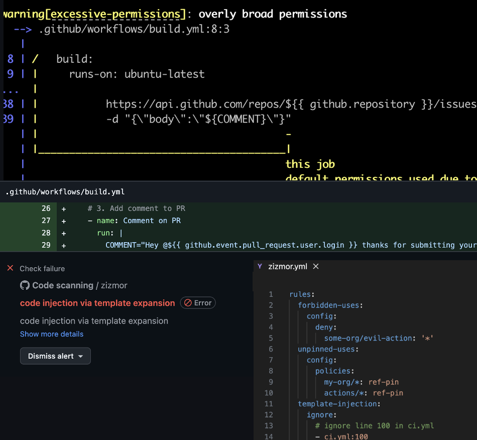

<!--
_backgroundColor: #1E3A8A
_color: white
_footer: ''

-->

<style scoped>
.title-container {
  display: flex;
  align-items: center;
  gap: 2rem;
  height: 85%;
  padding: 2rem;
}

.title-content {
  flex: 1;
  display: flex;
  flex-direction: column;
  justify-content: center;
  gap: 2rem;
}

.title-content h1 {
  font-size: 2.5rem;
  color: #FFFFFF;
  text-shadow: 2px 2px 4px rgba(0, 0, 0, 0.3);
  font-weight: 700;
  margin: 0;
}

.speaker-image {
  flex: 0 0 35%;
  display: flex;
  justify-content: center;
  align-items: center;
}

.speaker-photo {
  width: 350px;
  height: 350px;
  object-fit: cover;
  border-radius: 50%;
  box-shadow: 0 12px 48px rgba(0, 0, 0, 0.4);
}

.speaker-info {
  margin-top: 1rem;
}

.speaker-name {
  font-size: 2rem;
  font-weight: bold;
  color: #DBEAFE;
  margin: 0 0 0.5rem 0;
}

.speaker-title {
  font-size: 1.2rem;
  color: #93C5FD;
  margin: 0;
  font-weight: 300;
  font-style: italic;
}
</style>

<div class="title-container">
  <div class="title-content">
    <h1>Weaponizing GitHub Actions</h1>
    <div class="speaker-info">
      <div class="speaker-name">Niek Palm</div>
    </div>
  </div>
  
  <div class="speaker-image">
    
  </div>
</div>

---


<!--
_backgroundColor: #4C1D95
_color: white
-->

<style scoped>
.attacks-container {
  display: flex;
  flex-direction: column;
  gap: 1rem;
  height: 85%;
  padding: 0.5rem;
}

.intro-box {
  text-align: center;
  background: rgba(255, 255, 255, 0.1);
  border-radius: 12px;
  padding: 0.6rem;
  box-shadow: 0 4px 20px rgba(0, 0, 0, 0.4);
}

.intro-box p {
  margin: 0;
  font-size: 0.75rem;
  color: #FEE2E2;
  font-style: italic;
}

.attacks-grid {
  display: grid;
  grid-template-columns: repeat(2, 1fr);
  gap: 1rem;
  flex: 1;
}

.attack-card {
  background: rgba(0, 0, 0, 0.3);
  border-radius: 10px;
  padding: 1rem;
  box-shadow: 0 4px 20px rgba(0, 0, 0, 0.5);
  display: flex;
  flex-direction: column;
  gap: 0.5rem;
}

.attack-header {
  display: flex;
  align-items: center;
  gap: 0.5rem;
  padding-bottom: 0.3rem;
}

.attack-emoji {
  font-size: 1.4rem;
  flex-shrink: 0;
}

.attack-title {
  font-size: 0.75rem;
  font-weight: bold;
  color: #FEF3C7;
  margin: 0;
}

.attack-details {
  flex: 1;
}

.attack-detail {
  font-size: 0.6rem;
  color: #FEE2E2;
  margin: 0.3rem 0;
  line-height: 1.3;
}

.attack-year {
  font-size: 0.55rem;
  color: #FCA5A5;
  font-style: italic;
  margin: 0;
}

.attack-impact {
  background: rgba(239, 68, 68, 0.2);
  border-radius: 6px;
  padding: 0.4rem;
  margin-top: 0.3rem;
}

.impact-label {
  font-size: 0.55rem;
  font-weight: bold;
  color: #FECACA;
  margin: 0 0 0.2rem 0;
}

.impact-text {
  font-size: 0.58rem;
  color: #FEE2E2;
  margin: 0;
  line-height: 1.2;
}

.stat-highlight {
  color: #FCA5A5;
  font-weight: bold;
}
</style>

# 💥 Supply Chain Attacks in the Wild

<div class="attacks-container">
  <div class="attacks-grid">
    <div class="attack-card">
      <div class="attack-header">
        <span class="attack-emoji">🔥</span>
        <div>
          <h3 class="attack-title">SolarWinds</h3>
          <p class="attack-year">2020</p>
        </div>
      </div>
      <div class="attack-details">
        <p class="attack-detail">Compromised build system injected malicious code into legitimate software updates affecting 18,000+ organizations including government agencies and Fortune 500 companies</p>
      </div>
    </div>
    <div class="attack-card">
      <div class="attack-header">
        <span class="attack-emoji">💀</span>
        <div>
          <h3 class="attack-title">CodeCov</h3>
          <p class="attack-year">2021</p>
        </div>
      </div>
      <div class="attack-details">
        <p class="attack-detail">Docker image compromised in CI/CD pipeline, stealing credentials and secrets from hundreds of customers</p>
      </div>
    </div>
    <div class="attack-card">
      <div class="attack-header">
        <span class="attack-emoji">⚡</span>
        <div>
          <h3 class="attack-title">tj-actions/changed-files</h3>
          <p class="attack-year">2025</p>
        </div>
      </div>
      <div class="attack-details">
        <p class="attack-detail">Attackers compromised maintainer bot token, manipulated version tags to point to malicious commits, exfiltrating CI/CD secrets from 23,000+ repositories using this popular GitHub Action</p>
      </div>
    </div>
    <div class="attack-card">
      <div class="attack-header">
        <span class="attack-emoji">🎭</span>
        <div>
          <h3 class="attack-title">S1ngularity (Nx)</h3>
          <p class="attack-year">2025</p>
        </div>
      </div>
      <div class="attack-details">
        <p class="attack-detail">Exploited pull_request_target injection to steal npm token, published malicious Nx packages, weaponized AI tools for secrets exfiltration, exposed 1000s of secrets and private repos</p>
      </div>
    </div>
  </div>
</div>


---
<!--
_backgroundColor: #00629F
_color: white
-->

<style scoped>
.slide-container {
  display: flex;
  align-items: flex-start;
  gap: 1.5rem;
  height: 100%;
}

.left-section {
  flex: 0 0 450px;
  display: flex;
  align-items: center;
  justify-content: center;
}

.gh-actions-img {
  width: 450px;
  height: 450px;
  object-fit: cover;
  border-radius: 20px;
  box-shadow: 0 8px 32px rgba(0, 0, 0, 0.3);
  background: rgba(255, 255, 255, 0.1);
  backdrop-filter: blur(10px);
}

.right-section {
  flex: 1;
  display: flex;
  align-items: center;
  justify-content: center;
}

.right-section p {
  padding: 1.2rem;
  font-size: 1.15rem;
  line-height: 1.5;
  font-style: italic;
  word-wrap: break-word;
  hyphens: auto;
  color: white;
}


</style>

# 🤖 What is GitHub Actions?

<div class="slide-container">
  <div class="left-section">
    
  </div>
  
  <div class="right-section">
    <p>"GitHub Actions automates your software development workflow, letting you build, test, and deploy code directly from your GitHub repository. Its tight integration with GitHub has made it one of the most widely adopted CI/CD solutions."</p>
  </div>
</div>


---
<!--
_backgroundColor: #0072DA
_color: white
-->

<style scoped>
.example-container {
  display: flex;
  align-items: flex-start;
  gap: 1rem;
  height: 100%;
}

.code-section {
  flex: 0 0 50%;
}

.code-section pre {
  border-radius: 12px;
  box-shadow: 10px 10px 20px rgba(0, 0, 0, 0.3);
  padding: 1.5rem;
  margin: 0;
}

.explanation-section {
  flex: 1;
}

.explanation-section h3 {
  font-size: 1.3rem;
  margin-bottom: 1rem;
}

.explanation-section ol {
  font-size: 0.8rem;
  line-height: 1.9;
}
</style>

# ⚙️ Example workflow

<div class="example-container">
  <div class="code-section">

```yaml
name: GitHub Actions Example

on: [push, pull_request]                           # 1

jobs:
  build:
    runs-on: [ubuntu-latest]                       # 2
    
    steps:
    - name: Checkout code
      uses: actions/checkout@v5                    # 3
        
    - name: Install dependencies
      run: npm ci                                  # 4
      
    - name: Run tests
      run: npm test                                # 4
```

  </div>
  
  <div class="explanation-section">
    <h3>🔍 <strong>What's happening?</strong></h3>
    <ol>
      <li><strong>Trigger</strong>: on <code>push</code> or <code>pull_request</code></li>
      <li><strong>Runner</strong>: GitHub hosted fleet<br><code>ubuntu-latest</code></li>
      <li><strong>Third party action</strong>: <code>checkout@v5</code></li>
      <li><strong>Run script</strong>: <code>npm ...</code></li>
    </ol>
  </div>
</div>


---

<!--
_backgroundColor: #0B5ED7
_color: white
-->

<style scoped>
.usecases-container {
  display: flex;
  flex-direction: column;
  gap: 1.5rem;
  height: 85%;
  padding: 1rem;
}

.intro-text {
  text-align: center;
  background: rgba(255, 255, 255, 0.1);
  border-radius: 12px;
  padding: 0.8rem;
  box-shadow: 0 4px 20px rgba(0, 0, 0, 0.3);
}

.intro-text p {
  margin: 0;
  font-size: 0.8rem;
  color: #F3E8FF;
  font-style: italic;
}

.usecases-grid {
  display: grid;
  grid-template-columns: repeat(4, 1fr);
  gap: 0.3rem;
  align-content: start;
}

.usecase-card {
  padding: 0.2rem 0.1rem 0.2rem 0.8rem;
  gap: 0.8rem;
  height: 2.0rem;
  display: flex;
  align-items: center;
  justify-content: flex-start;
}

.usecase-emoji {
  font-size: 1.0rem;
  flex-shrink: 0;
  line-height: 1.0;
}

.usecase-text {
  font-size: 0.45rem;
  font-weight: bold;
  color: #F7FAFC;
  margin: 0;
  padding: 0;
  line-height: 1;
}
</style>

# 🚀 Actions Everywhere
*From development to deployment - GitHub Actions powers our entire software lifecycle*
<div class="usecases-container">

  
  <div class="usecases-grid">
    <div class="usecase-card card-dark">
      <span class="usecase-emoji">🏗️</span>
      <p class="usecase-text">Build & compile code</p>
    </div>
    <div class="usecase-card card-dark">
      <span class="usecase-emoji">🐳</span>
      <p class="usecase-text">Build containers</p>
    </div>
    <div class="usecase-card card-dark">
      <span class="usecase-emoji">🧪</span>
      <p class="usecase-text">Run unit tests</p>
    </div>
    <div class="usecase-card card-dark">
      <span class="usecase-emoji">🎭</span>
      <p class="usecase-text">Run E2E tests</p>
    </div>
    <div class="usecase-card card-dark flex-center">
      <span class="usecase-emoji">🛡️</span>
      <p class="usecase-text">Security scanning</p>
    </div>
    <div class="usecase-card card-dark flex-center">
      <span class="usecase-emoji">🔍</span>
      <p class="usecase-text">Code quality checks</p>
    </div>
    <div class="usecase-card card-dark flex-center">
      <span class="usecase-emoji">📦</span>
      <p class="usecase-text">Publish packages</p>
    </div>
    <div class="usecase-card card-dark flex-center">
      <span class="usecase-emoji">☁️</span>
      <p class="usecase-text">Deploy to cloud</p>
    </div>
    <div class="usecase-card card-dark flex-center">
      <span class="usecase-emoji">🔄</span>
      <p class="usecase-text">Manage infrastructure</p>
    </div>
    <div class="usecase-card card-dark flex-center">
      <span class="usecase-emoji">🚀</span>
      <p class="usecase-text">Release automation</p>
    </div>
    <div class="usecase-card card-dark flex-center">
      <span class="usecase-emoji">📚</span>
      <p class="usecase-text">Generate docs</p>
    </div>
    <div class="usecase-card card-dark flex-center">
      <span class="usecase-emoji">🌐</span>
      <p class="usecase-text">Deploy static sites</p>
    </div>
    <div class="usecase-card card-dark">
      <span class="usecase-emoji">🔄</span>
      <p class="usecase-text">Update dependencies</p>
    </div>
    <div class="usecase-card card-dark">
      <span class="usecase-emoji">🏷️</span>
      <p class="usecase-text">Tag & version</p>
    </div>
    <div class="usecase-card card-dark">
      <span class="usecase-emoji">🤖</span>
      <p class="usecase-text">Automate workflows</p>
    </div>
    <div class="usecase-card card-dark">
      <span class="usecase-emoji">📊</span>
      <p class="usecase-text">Generate reports</p>
    </div>
    <div class="usecase-card card-dark">
      <span class="usecase-emoji">📧</span>
      <p class="usecase-text">Send notifications</p>
    </div>
    <div class="usecase-card card-dark">
      <span class="usecase-emoji">🔐</span>
      <p class="usecase-text">Manage secrets</p>
    </div>
    <div class="usecase-card card-dark">
      <span class="usecase-emoji">🎯</span>
      <p class="usecase-text">Issue triage</p>
    </div>
    <div class="usecase-card card-dark">
      <span class="usecase-emoji">🌍</span>
      <p class="usecase-text">Multi-platform builds</p>
    </div>
  </div>
</div>

---

<!--
_backgroundColor: #B91C1C
_color: white
-->

<style scoped>
pre {
  border-radius: 12px;
  box-shadow: 0 4px 20px rgba(0, 0, 0, 0.3);
}
</style>

# 🔥 What can go wrong?


```yaml
name: Check Changed Files

on: [pull_request]

jobs:
  check-changes:
    runs-on: ubuntu-latest
    steps:
    - uses: actions/checkout@v4.0.0
    
    - name: Get changed files
      uses: tj-actions/changed-files@v45.0.7
      id: changed-files
      with:
        files: |
          src/**
          docs/**
    
    - name: Process changes
      run: echo "Changed files: ${{ steps.changed-files.outputs.all_changed_files }}"
```


---

<!--
_backgroundColor: #DC2626
_color: white
-->

<style scoped>
.attack-container {
  display: grid;
  grid-template-columns: 2fr 3fr;
  gap: 2rem;
  height: 80%;
  align-items: center;
}

.attack-content {
  display: flex;
  flex-direction: column;
  gap: 1.5rem;
}

.attack-point {
  background: rgba(255, 255, 255, 0.15);
  border-radius: 12px;
  padding: 1.5rem;
  box-shadow: 0 4px 20px rgba(0, 0, 0, 0.4);
}

.attack-point p {
  margin: 0;
  font-size: 1.1rem;
  line-height: 3.22;
}

.attack-image {
  display: flex;
  justify-content: center;
  align-items: center;
}

.attack-image img {
  max-width: 100%;
  max-height: 100%;
  object-fit: contain;
  box-shadow: 0 4px 20px rgba(0, 0, 0, 0.4);
  border-radius: 12px;

}
</style>

# 🎯 Repository takeover

<div class="attack-container">
  <div class="attack-point">
      <p>🚀 Push Malicious Code<p>
      <p>✨ Create Releases</p>
      <p>🏷️ Rewrite Tags</p>
  </div>

  
  <div class="attack-image">
    
  </div>
</div>

---

<!--
_backgroundColor: #059669
_color: white
-->

<style scoped>
.solution-container {
  display: grid;
  grid-template-columns: 2fr 3fr;
  gap: 2rem;
  height: 80%;
  align-items: center;
}

.solution-content {
  display: flex;
  flex-direction: column;
  gap: 1.5rem;
}

.solution-point {
  background: rgba(255, 255, 255, 0.15);
  border-radius: 12px;
  padding: 1.5rem;
  box-shadow: 0 4px 20px rgba(0, 0, 0, 0.4);
}

.solution-point h4 {
  margin: 0 0 0.8rem 0;
  color: #F0FDF4;
  font-size: 0.85rem;
  line-height: 2.2;
}

.solution-code {
  display: flex;
  justify-content: center;
  align-items: center;
}

.solution-code pre {
  border-radius: 12px;
  box-shadow: 0 4px 20px rgba(0, 0, 0, 0.4);
  padding: 1.5rem;
  margin: 0;
  width: 100%;
}
</style>

# ✅ Secure third-party actions

<div class="solution-container">
  <div class="solution-content">
    <div class="solution-point">
      <h4>🔒 Lock SHA</h4>
      <h4>🔍 Verify Integrity</h4>
      <h4>🤖 Manage with Dependabot</h4>
      <h4>🛡️ Minimal Privilege</h4>
    </div>
  </div>
  
  <div class="solution-code">

```yaml
name: Secure Workflow

on: [pull_request]

jobs:
  secure-build:
    runs-on: ubuntu-latest
    steps:
      # SHA-pinned action for security
    - uses: actions/checkout@08c690...      # v5.0.0 ← SECURE
    
    - name: Get changed files
      # SHA-pinned action for security
      uses: tj-actions/changed-files@24d32f... # v47 ← SECURE
      
    - name: Process changes
      ...
```

  </div>
</div>


---


<!--
_backgroundColor: #2D3748
_color: white
-->

<style scoped>
.code-container {
  display: flex;
  justify-content: center;
  align-items: center;
  height: 80%;
}

.code-section {
  width: 70%;
}

.code-section pre {
  border-radius: 12px;
  box-shadow: 0 4px 20px rgba(0, 0, 0, 0.3);
  padding: 2rem;
  margin: 0;
  font-size: 0.8rem;
}
</style>

# 🤔 What can go wrong? 

<div class="code-container">
  <div class="code-section">

```yaml
name: Issue Logger

on:
  issues:
    types: [opened]

jobs:
  log-issue:
    runs-on: ubuntu-latest
    steps:
    - name: Log issue details
      run: |
        echo "Issue: ${{ github.event.issue.title }}"
        echo "Description: ${{ github.event.issue.body }}"
```

  </div>
</div>


---


<!--
_backgroundColor: #000000
_footer: ''

-->

<style scoped>
section {
  padding: 0;
  margin: 0;
  width: 100%;
  height: 100%;
  display: flex;
  align-items: center;
  justify-content: center;
}

video {
  width: 100%;
  height: 100%;
  max-width: 100vw;
  max-height: 100vh;
  object-fit: contain;
}
</style>

<video src="assets/injection.webm" controls></video>

---


<!--
_backgroundColor: #059669
_color: white
-->

<style scoped>


.code-container {
  display: flex;
  justify-content: center;
  align-items: center;
  height: 80%;
}

.code-section {
  width: 70%;
}

.code-section pre {
  border-radius: 12px;
  box-shadow: 0 4px 20px rgba(0, 0, 0, 0.3);
  padding: 2rem;
  margin: 0;
  font-size: 0.8rem;
}
</style>

# ✅ The solution

<div class="code-container">
  <div class="code-section">

```yaml
name: Issue Logger

on:
  issues:
    types: [opened]

jobs:
  log-issue:
    runs-on: ubuntu-latest
    steps:
    - name: Log issue details
      env:                                              # ← NEW
        ISSUE_TITLE: ${{ github.event.issue.title }}    # ← NEW
        ISSUE_BODY: ${{ github.event.issue.body }}      # ← NEW  
      run: |
        echo "Issue: $ISSUE_TITLE"                      # ← CHANGED
        echo "Description: $ISSUE_BODY"                 # ← CHANGED
```

  </div>
</div>


---

<!--
_backgroundColor: #059669
_color: white
-->

<style scoped>
.opensource-container {
  display: flex;
  flex-direction: column;
  gap: 1rem;
  height: 85%;
  padding: 0.8rem;
}

.intro-text {
  text-align: center;
  background: rgba(255, 255, 255, 0.15);
  border-radius: 12px;
  padding: 0.5rem;
  box-shadow: 0 4px 20px rgba(0, 0, 0, 0.4);
}

.intro-text p {
  margin: 0;
  font-size: 0.8rem;
  color: #F0FDF4;
  font-style: italic;
}

.tools-grid {
  display: grid;
  grid-template-columns: repeat(3, 1fr);
  gap: 1rem;
  flex: 1;
}

.tool-card {
  padding: 1rem;
  background: rgba(34, 197, 94, 0.2);
  border-radius: 12px;
  box-shadow: 0 4px 20px rgba(0, 0, 0, 0.4);
  display: flex;
  flex-direction: column;
  gap: 0.6rem;
  align-items: center;
  text-align: center;
  border: 1px solid rgba(34, 197, 94, 0.3);
}

.tool-emoji {
  font-size: 1.8rem;
  margin-bottom: 0.2rem;
}

.tool-name {
  font-size: 0.9rem;
  font-weight: bold;
  color: #ECFDF5;
  margin: 0 0 0.3rem 0;
}

.tool-description {
  font-size: 0.65rem;
  color: #D1FAE5;
  margin: 0;
  line-height: 1.3;
  flex-grow: 1;
}

.tool-focus-security {
  font-size: 0.6rem;
  color: #FEF3C7;
  font-weight: bold;
  margin: 0;
  padding: 0.2rem 0.6rem;
  background: rgba(180, 83, 9, 0.9);
  border-radius: 6px;
  box-shadow: 0 2px 4px rgba(0, 0, 0, 0.3);
}
</style>

# 🛡️ How to Fix Security Issues


<div class="opensource-container">
  
  <div class="tools-grid">
    <div class="tool-card">
      <span class="tool-emoji">⚙️</span>
      <h3 class="tool-name">Guardrails by Configuration</h3>
      <p class="tool-description">Set workflow permissions to read-only by default, require approval for external contributors, and enable security hardening in repository settings.</p>
      <p class="tool-focus-security">Restrictive</p>
    </div>
    <div class="tool-card">
      <span class="tool-emoji">🔒</span>
      <h3 class="tool-name">GitHub Advanced Security</h3>
      <p class="tool-description">Built-in code scanning, secret scanning, and dependency review that automatically detects vulnerabilities in your workflows and provides remediation guidance.</p>
      <p class="tool-focus-security">Detective & Preventive</p>
    </div>
    <div class="tool-card">
      <span class="tool-emoji">⚡</span>
      <h3 class="tool-name">Zizmor</h3>
      <p class="tool-description">Open-source static analyzer with CLI that integrates seamlessly into CI/CD pipelines and works well with pre-commit hooks for early detection.</p>
      <p class="tool-focus-security">Detective & Preventive</p>
    </div>
  </div>
</div>


---

<!--
_backgroundColor: #1A202C
_color: white
-->

<style scoped>
.zizmor-container {
  display: grid;
  grid-template-columns: 1fr 1fr;
  gap: 2rem;
  height: 85%;
  align-items: start;
}

.image-section {
  display: flex;
  justify-content: center;
  align-items: flex-start;
  height: 100%;
}

.placeholder-image {
  max-width: 100%;
  max-height: 100%;
  object-fit: contain;
  border-radius: 12px;
  box-shadow: 0 8px 32px rgba(0, 0, 0, 0.3);
}

.zizmor-content {
  display: flex;
  flex-direction: column;
  gap: 1.2rem;
}

.zizmor-item {
  background: rgba(255, 255, 255, 0.1);
  border-radius: 12px;
  padding: 0.8rem;
  box-shadow: 0 4px 20px rgba(0, 0, 0, 0.3);
  display: flex;
  align-items: center;
  gap: 1rem;
}

.zizmor-emoji {
  font-size: 1.4rem;
  flex-shrink: 0;
}

.zizmor-text {
  font-size: 0.7em;
  line-height: 1.0;
  color: #F7FAFC;
  margin: 0;
}

.zizmor-highlight {
  color: #FCD34D;
  font-weight: bold;
}
</style>

# 🔧 Zizmor static analysis for GitHub Actions

<div class="zizmor-container">
  <div class="image-section">
    <div class="placeholder-image">
      
    </div>
  </div>
  
  <div class="zizmor-content">
    <div class="zizmor-item">
      <span class="zizmor-emoji">📋</span>
      <p class="zizmor-text"><span class="zizmor-highlight">Extensive rule set</span> for comprehensive scanning</p>
    </div>
    <div class="zizmor-item">
      <span class="zizmor-emoji">⚙️</span>
      <p class="zizmor-text"><span class="zizmor-highlight">Highly configurable</span> to fit your needs</p>
    </div>
    <div class="zizmor-item">
      <span class="zizmor-emoji">🔗</span>
      <p class="zizmor-text"><span class="zizmor-highlight">Integrates with GHAS</span> seamlessly</p>
    </div>
    <div class="zizmor-item">
      <span class="zizmor-emoji">🛠️</span>
      <p class="zizmor-text"><span class="zizmor-highlight">Use with CLI, IDE, pre-commit or Actions</span></p>
    </div>
  </div>
</div>


---

<!--
_backgroundColor: #4A5568
_color: white
-->

<style scoped>
.note-container {
  display: flex;
  justify-content: center;
  align-items: center;
  height: 85%;
}

.image-section {
  display: flex;
  justify-content: center;
  align-items: flex-start;
  height: 100%;
}

.placeholder-image {
  max-width: 100%;
  max-height: 100%;
  object-fit: contain;
  border-radius: 12px;
  box-shadow: 0 8px 32px rgba(0, 0, 0, 0.3);
}

.note-box {
  background: rgba(255, 255, 255, 0.1);
  border-radius: 16px;
  padding: 1.0rem;
  box-shadow: 0 8px 32px rgba(0, 0, 0, 0.3);
  width: 80%;
  max-width: 900px;
}

.note-list {
  list-style: none;
  padding: 0;
  margin: 0;
}

.note-item {
  font-size: 0.7rem;
  line-height: 1.5;
  color: #F7FAFC;
  margin-bottom: 0.7rem;
  display: flex;
  align-items: center;
  gap: 0.8rem;
}

.note-emoji {
  font-size: 1.2rem;
  flex-shrink: 0;
}

.note-highlight {
  color: #FCD34D;
  font-weight: bold;
}
</style>

# <!-- fit -->🔒 Beyond Pipeline Security

<div class="note-container">

  
  <div class="note-box">
    <ul class="note-list">
      <li class="note-item">
        <span class="note-emoji">🏃</span>
        <span><span class="note-highlight">Runtime security</span><br> GitHub runners are ephemeral but unrestricted, self-hosted runners need hardening</span>
      </li>
      <li class="note-item">
        <span class="note-emoji">🛡️</span>
        <span><span class="note-highlight">Repository controls</span><br> Branch protection, required reviews, and access policies guard your code</span>
      </li>
      <li class="note-item">
        <span class="note-emoji">⚠️</span>
        <span><span class="note-highlight">Third-party dependencies</span><br> Actions and code from external sources execute in your trusted context</span>
      </li>
    </ul>
  </div>


---

<!--
_backgroundColor: #D10077
_color: purple
-->


<!--
_backgroundColor: #1E40AF
_color: white
-->

<style scoped>
.group-security-container {
  display: flex;
  flex-direction: column;
  gap: 1.5rem;
  height: 85%;
  padding: 1rem;
}

.intro-message {
  text-align: center;
}

.intro-message p {
  margin: 0;
  font-size: 1.0rem;
  color: #DBEAFE;
  font-style: italic;
}

.resources-grid {
  display: grid;
  grid-template-columns: 1fr 1fr;
  gap: 1.5rem;
  flex: 1;
}

.resource-card {
  padding: 1.0rem;
  gap: 0.8rem;
  background: rgba(59, 130, 246, 0.15);
  border: 1px solid rgba(59, 130, 246, 0.3);
}

.resource-header {
  display: flex;
  align-items: center;
  gap: 0.6rem;
  margin-bottom: 0.4rem;
}

.resource-emoji {
  font-size: 1.8rem;
  flex-shrink: 0;
}

.resource-title {
  font-size: 0.7rem;
  font-weight: bold;
  color: #DBEAFE;
  margin: 0;
  line-height: 1.2;
}

.resource-description {
  font-size: 0.5rem;
  color: #BFDBFE;
  margin: 0;
  line-height: 1.4;
}

.resource-highlight {
  color: #60A5FA;
  font-weight: bold;
}
</style>

<!--
_backgroundColor: #1E40AF
_color: white
_footer: ''
-->

<style scoped>
.resources-container {
  display: grid;
  grid-template-columns: 3fr 2fr;
  gap: 2rem;
  height: 85%;
  align-items: start;
  padding: 1rem;
}

.links-section {
  display: flex;
  flex-direction: column;
  gap: 1rem;
  position: relative;
}

.links-image-container {
  position: relative;
  flex: 0 0 60%;
  display: flex;
  justify-content: center;
  align-items: center;
  overflow: hidden;
}

.links-image {
  max-width: 100%;
  max-height: 450px;
  object-fit: contain;
  border-radius: 12px;
  box-shadow: 0 8px 32px rgba(0, 0, 0, 0.3);
}

.github-sticker {
  position: absolute;
  top: 20%;
  right: 10%;
  background: #24292F;
  color: white;
  padding: 0.8rem 1.2rem;
  border-radius: 12px;
  font-size: 0.7rem;
  font-weight: bold;
  box-shadow: 0 6px 20px rgba(0, 0, 0, 0.5);
  transform: rotate(12deg);
  z-index: 10;
  border: 2px solid #F0F6FF;
  text-align: center;
  line-height: 1.3;
}

.qr-section {
  display: flex;
  flex-direction: column;
  align-items: center;
  justify-content: center;
  gap: 1rem;
  height: 100%;
}

.qr-container {
  background: transparent;
  border-radius: 12px;
  padding: 0;
  box-shadow: 0 4px 20px rgba(0, 0, 0, 0.4);
  display: flex;
  justify-content: center;
  align-items: center;
}

.qr-code {
  max-width: 300px;
  max-height: 300px;
  width: 300px;
  height: 300px;
  object-fit: contain;
  display: block;
  margin: 0 auto;
}

.qr-label {
  font-size: 0.8rem;
  color: #DBEAFE;
  text-align: center;
  font-style: italic;
}
</style>

# 🔗 Resources and links

<div class="resources-container">
  <div class="links-section">
    <div class="links-image-container">
      
      <div class="github-sticker">
        🔗 github.com/npalm/<br>
        github-actions-security-talk
      </div>
    </div>
  </div>
  
  <div class="qr-section">
    <div class="qr-container">
      
    </div>
    <p class="qr-label">Scan for resources</p>
  </div>
</div>


---


<!--
-->

<style scoped>
section {
  display: flex;
  justify-content: flex-start;
  align-items: center;
}

.qa-content {
  font-size: 4rem;
  color: white;
  text-shadow: 3px 3px 6px rgba(0, 0, 0, 0.8);
  position: absolute;
  left: 5%;
  top: 50%;
  transform: translateY(-50%);
}

footer {
  position: absolute;
  bottom: 20px;
  right: 20px;
  left: auto;
  text-align: right;
}

footer img {
  height: 150px !important;
  max-height: 150px !important;
  width: auto;
}
</style>

<div class="qa-content">

💬  🍻  🙏

</div>


